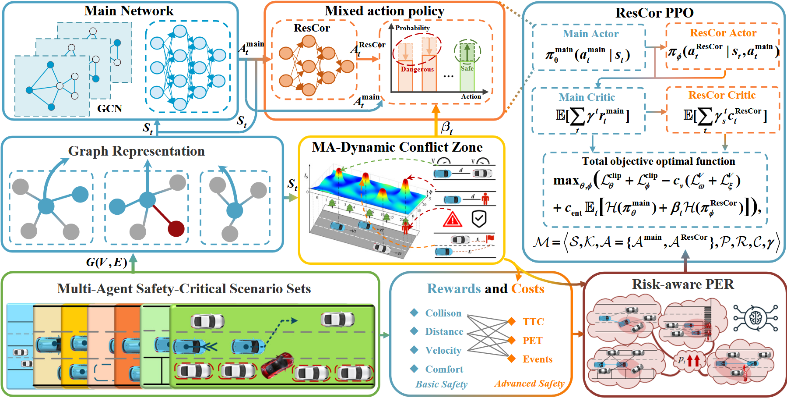

<div align="center">   
  
# ResCor: Residual Correct Safe Reinforcement Learning for Multi-agent Safety-critical Scenarios
</div>


# Abstract
Low-frequency but high-risk safety-critical events are the root of the long-tail effect in autonomous driving. When individual intelligence expands to multi-agent safety-critical scenarios (MASCS), their complexity surpasses single-agent theory and demands new collective-decision paradigms. Existing safe reinforcement learning (RL) methods, ranging from explicit safety masks to implicit Lagrangian constraints, improve ssfety yet either lock policies inside rigid safe sets or degrade efficiency through poor constraint representation. We introduce weak-to-strong generalisation into safe RL for the first time and propose **ResCor**, a **res**idual **cor**rection safe reinforcement learning framework that raises both safety and performance in MASCS. ResCor combines three modules: (i) a mixed-action policy that adaptively calibrates safety boundaries, (ii) a multi-agent dynamic conflict zone that captures and quantifies risk interactions, and (iii) a risk-aware prioritised experience replay that focuses learning on rare, high-risk events. Notably, the lightweight ResCor uses only 10% of the main model’s parameters yet provides decisive safety guidance without hindering task efficiency. Experiments on five MASCS show that ResCor cuts collision rates by up to **90.6\%** and increases cumulative rewards by 51.6% over strong baselines. It also transfers smoothly to unseen, more complex MASCS, highlighting its promise as a lightweight pre-trained safety module for real-world autonomous driving. 


# Methods



# Demonstration Video
### 1. HardBrake (2AVs)
https://github.com/user-attachments/assets/bf93df98-87bf-47a8-ba90-6fb45349a876

### 2. ParkingCrossingPed (2AVs)
https://github.com/user-attachments/assets/b1884a59-f852-4578-9485-da4b8bc7096e

### 3. ParkingCutIn
https://github.com/user-attachments/assets/77d7321c-3964-454e-942c-48e3a23de0e2

### 4. DynamicCutIn
https://github.com/user-attachments/assets/28ab3067-8eee-47c5-bcc1-beb343859d38

### 5. IntersectionViolationPeds
https://github.com/user-attachments/assets/af382656-0129-44ad-b268-4a5a949c242d

### 6. HardBrake (3AVs)
https://github.com/user-attachments/assets/ee3df668-0507-4af8-a49c-f1f25770f809

### 7. ParkingCrossingPed (3AVs)
https://github.com/user-attachments/assets/68386b05-fec7-4085-93f3-ba647bec134f


# Installation
```shell
# Clone the code to local
git clone https://github.com/Wangkaifeng-2021/ResCor.git
cd ResCor

# Create virtual environment
conda create -n ResCor python=3.7
conda activate ResCor

# Install basic dependency
pip install -r requirements.txt
```
